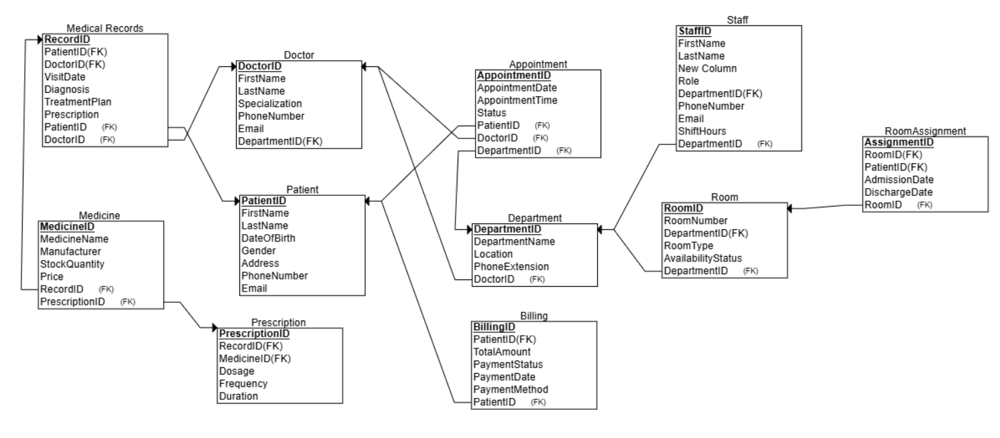

# Hospital ETL and Power BI Dashboard

This project showcases a complete data pipeline for a hospital database system, including SQL-based ETL processes, conceptual data modeling, and a Power BI dashboard for visual analytics. The project is designed to simulate real-world hospital operations and support data-driven decision-making through end-to-end integration from raw data to insights.

---

## Project Structure

**SQL_Scripts**

DDL.sql - Contains Data Definition Language statements for creating normalized tables

DML.sql - Contains Data Manipulation Language statements for inserting synthetic data 

Analytical_Queries.sql - Includes business intelligence queries for insights on patients, appointments, revenue, etc.

**Diagrams**

Conceptual_Model.png - Conceptual ER diagram representing entities and their relationships

**PowerBI**

Dashboard.pbix - (File not hosted here, but linked below)

**README.md**

## Key Features

- **SQL ETL Pipeline**: Structured scripts for creating and populating a normalized hospital database
- **Conceptual Data Modeling**: Entity-relationship diagram illustrating the logical structure of the database
- **BI Queries**: Insightful SQL queries for analyzing hospital operations such as doctor workload, room utilization, prescription patterns, and finances
- **Power BI Dashboard**: Dynamic, interactive visualizations for stakeholders including hospital admins, finance teams, and medical staff

---

## Power BI Dashboard

Explore the interactive dashboard built using Power BI. It includes:

- Total patients, appointments, and room occupancy
- Doctor-to-patient ratio
- Revenue breakdown by department
- Trends in prescription patterns
- Filters by department, time, and location

**[View Power BI Dashboard](https://your-dashboard-link.com](https://app.powerbi.com/groups/me/reports/97b82f21-6f4f-4431-b84d-c609ae1f0f3e/0a9dd7b9f5ad7726b05d?experience=power-bi)**  

---

## Conceptual ER Diagram

The following diagram outlines the high-level design of the normalized database:

---

## Technologies Used

- **SQL Server** – for data modeling, ETL, and analytics
- **T-SQL** – for DDL, DML, and analytical querying
- **Power BI** – for building dashboards and visual storytelling
- **Draw.io** – for conceptual diagram design

---

## Source & Licensing

- Synthetic data was generated for educational purposes.
- This project is open for learning, showcasing SQL and BI skills.

---

## Contributors

The following members contributed to this project:

- Neetika Upadhyay  
- Maruta Zalane  
- Shiva
- Prajna Ganji
  
---

## Contact

For questions or collaboration inquiries:  
**Neetika Upadhyay**  
Ottawa, Canada  
[LinkedIn]([https://www.linkedin.com/in/neetika-upadhyay/])

